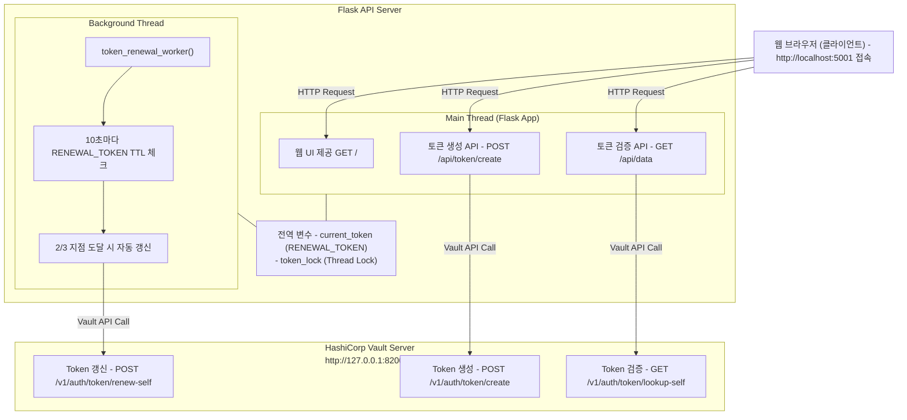

# Vault Token 기반 API 인증 시스템

Vault Token Auth를 활용한 API 서버 + 토큰 관리 웹 UI + 자동 토큰 갱신 시스템

---

## 목차

1. [시스템 개요](#시스tem-개요)
2. [프로젝트 구조](#프로젝트-구조)
3. [환경 설정](#환경-설정)
4. [함수별 상세 설명](#함수별-상세-설명)
5. [API 문서](#api-문서)
6. [사용 방법](#사용-방법)

---

## 시스템 개요
Vault의 토큰 발급 시스템을 이용해 별도의 토큰 발급 기능 개발 공수를 줄일 수 있습니다.
API 서버는 Vault에서 토큰을 생성해서 사용자에게 전달하고 사용자는 받은 토큰을 API 서버에 제출하면 API 서버는 전달받은 토큰을 Vault를 통해 유효성을 검사하고 자신의 서비스를 이용할 수 있도록 승인할 수 있습니다.

### 주요 기능

1. **웹 UI 기반 토큰 생성**
   - 브라우저에서 토큰 이름과 권한 선택
   - 생성된 토큰을 즉시 복사 가능

2. **Vault 토큰 검증 API**
   - 클라이언트가 보낸 토큰의 유효성 검증
   - 토큰 메타데이터(권한) 정보 반환

3. **자동 토큰 갱신 시스템**
   - 서버가 사용하는 RENEWAL_TOKEN을 백그라운드에서 자동 갱신
   - 토큰 수명의 2/3 지점에서 갱신
   - 멀티스레드 방식으로 서버 성능에 영향 없음

### 아키텍처 다이어그램


### 웹 UI


---

## 프로젝트 구조

```
vault-token-api/
├── server.py                    # 메인 Flask 서버 (이 문서 설명 대상)
├── client.py                    # API 클라이언트 (테스트용)
├── requirements.txt             # Python 패키지 의존성
├── README.md                    # 함수 설명 및 사용법 정리
│
└── .env                         # 환경 변수 설정 파일
```

---

## 환경 설정

### 1. 필수 요구사항

- **Python 3.7+**
- **HashiCorp Vault** (개발 모드)
- **현대 웹 브라우저**

### 2. 설치

```bash
# 1. Python 패키지 설치
pip install -r requirements.txt

# 2. Vault 설치 (macOS)
brew tap hashicorp/tap
brew install hashicorp/tap/vault

# 2-2. Vault 설치 (Ubuntu/Debian)
wget -O- https://apt.releases.hashicorp.com/gpg | sudo gpg --dearmor -o /usr/share/keyrings/hashicorp-archive-keyring.gpg
echo "deb [signed-by=/usr/share/keyrings/hashicorp-archive-keyring.gpg] https://apt.releases.hashicorp.com $(lsb_release -cs) main" | sudo tee /etc/apt/sources.list.d/hashicorp.list
sudo apt update && sudo apt install vault
```

### 3. 환경 변수 (.env 파일)

```bash
# Vault 서버 주소
VAULT_ADDR=http://127.0.0.1:8200

# API 서버 주소
TEST_SERVER=http://localhost:5001

# Vault Root Token (개발 환경)
VAULT_TOKEN=root

# 서버가 사용하는 갱신 가능한 토큰 (자동 생성됨)
RENEWAL_TOKEN=hvs.CAESXXXXXXXXXX...
```

---

## 함수별 상세 설명

### 전역 변수

#### 1. `VAULT_ADDR`
- **타입**: `str`
- **설명**: Vault 서버 주소
- **기본값**: `'http://127.0.0.1:8200'`
- **용도**: 모든 Vault API 호출의 기본 URL

#### 2. `RENEWAL_TOKEN`
- **타입**: `str`
- **설명**: API 서버가 토큰 생성/관리에 사용하는 마스터 토큰
- **기본값**: 환경변수에서 로드
- **특징**: 
  - TTL: 1분
  - Renewable: true
  - 백그라운드 스레드에서 자동 갱신

#### 3. `current_token`
- **타입**: `str`
- **설명**: 현재 활성화된 RENEWAL_TOKEN (전역 변수)
- **용도**: 토큰 생성 시 사용하는 인증 토큰
- **동기화**: `token_lock`으로 thread-safe 보장

#### 4. `token_lock`
- **타입**: `threading.Lock()`
- **설명**: 멀티스레드 환경에서 `current_token` 접근 제어
- **용도**: Race condition 방지

---

### 핵심 함수

#### 1. `get_token_info(token)`

**목적**: 토큰의 상세 정보를 Vault에서 조회

**파라미터**:
- `token` (str): 조회할 Vault 토큰

**반환값**:
- `dict`: 토큰 정보 (성공 시)
- `None`: 실패 시

**사용하는 변수**:
- `VAULT_ADDR`: Vault API 엔드포인트 주소

**동작 흐름**:
```python
1. Vault API 호출: GET /v1/auth/token/lookup-self
2. HTTP Header: X-Vault-Token: <token>
3. 응답 파싱: response.json()['data']
4. 반환: 토큰 정보 dict 또는 None
```

**토큰 정보 예시**:
```json
{
  "accessor": "BRCnmeVdHVA48bvESvZvbmyd",
  "creation_time": 1768436695,
  "creation_ttl": 3600,
  "display_name": "my-app",
  "ttl": 3540,
  "meta": {
    "create": "true",
    "read": "true"
  },
  "renewable": true
}
```

---

#### 2. `renew_token(token)`

**목적**: 토큰을 갱신하여 TTL을 초기화

**파라미터**:
- `token` (str): 갱신할 Vault 토큰

**반환값**:
- `True`: 갱신 성공
- `False`: 갱신 실패

**사용하는 변수**:
- `VAULT_ADDR`: Vault API 주소

**동작 흐름**:
```python
1. Vault API 호출: POST /v1/auth/token/renew-self
2. HTTP Header: X-Vault-Token: <token>
3. 응답 확인: status_code == 200
4. 로그 기록: "System - ✅ 토큰 갱신 성공"
```

**주의사항**:
- 토큰이 `renewable: true`여야 함
- 이미 만료된 토큰은 갱신 불가

---

#### 3. `token_renewal_worker()`

**목적**: 백그라운드 스레드에서 RENEWAL_TOKEN을 자동 갱신

**파라미터**: 없음 (전역 변수 사용)

**반환값**: 없음 (무한 루프)

**사용하는 전역 변수**:
- `current_token`: 현재 사용 중인 토큰
- `token_lock`: 스레드 안전성 보장

**동작 흐름**:
```python
while True:
    1. Lock 획득 → current_token 복사
    2. get_token_info()로 토큰 정보 조회
    3. TTL 정보 추출:
       - ttl: 남은 시간 (초)
       - creation_ttl: 전체 수명 (초)
    4. 갱신 임계값 계산:
       - renewal_threshold = creation_ttl * 2/3
    5. 조건 확인:
       - if ttl <= (creation_ttl - renewal_threshold):
           → renew_token() 호출
    6. 10초 대기 후 반복
```

**갱신 타이밍 예시**:
```
creation_ttl = 60초 (1분)
renewal_threshold = 60 * 2/3 = 40초

남은 시간 60초 → 갱신 안함
남은 시간 50초 → 갱신 안함
남은 시간 40초 → 갱신 안함
남은 시간 20초 → 갱신 실행! (60-40=20)
```

---

#### 4. `verify_token(token)`

**목적**: 클라이언트가 보낸 토큰의 유효성 검증

**파라미터**:
- `token` (str): 검증할 Vault 토큰

**반환값**:
- `tuple`: `(is_valid: bool, token_info: dict or None)`

**사용하는 변수**:
- `VAULT_ADDR`: Vault API 주소

**동작 흐름**:
```python
1. Vault API 호출: GET /v1/auth/token/lookup-self
2. Header: X-Vault-Token: <token>
3. 응답 확인:
   - status_code == 200 → (True, token_info)
   - 그 외 → (False, None)
```

**사용 예시**:
```python
is_valid, token_info = verify_token("hvs.CAESIG...")

if is_valid:
    user = token_info['data']['display_name']
    permissions = token_info['data']['meta']
```

---

#### 5. `create_vault_token(display_name, permissions, ttl='1h')`

**목적**: 웹 UI 또는 API 요청으로부터 새 Vault 토큰 생성

**파라미터**:
- `display_name` (str): 토큰 표시 이름
- `permissions` (dict): 권한 딕셔너리
  - 예: `{'create': True, 'read': True, 'update': False}`
- `ttl` (str): 토큰 유효 시간 (기본: 1시간)

**반환값**:
```python
{
    'success': bool,
    'token': str,        # 성공 시 토큰 값
    'message': str       # 결과 메시지
}
```

**사용하는 전역 변수**:
- `current_token`: 토큰 생성 권한이 있는 마스터 토큰
- `token_lock`: Thread-safe 접근 보장
- `VAULT_ADDR`: Vault API 주소

**동작 흐름**:
```python
1. Lock 획득 → current_token 복사
2. metadata 구성:
   - permissions에서 True인 항목만 추출
   - meta = {'create': 'true', 'read': 'true'}
3. Vault API 호출:
   - POST /v1/auth/token/create
   - Header: X-Vault-Token: <current_token>
   - Body: {
       'display_name': 'my-app',
       'ttl': '1h',
       'meta': {'create': 'true'}
     }
4. 응답 파싱:
   - client_token 추출
   - 성공 메시지 반환
```

**중요**: `meta` 필드 사용 (~~`metadata`~~ 아님!)

---

### 웹 UI 라우트

#### 6. `index()` - `GET /`

**목적**: 토큰 생성 웹 UI 페이지 제공

**파라미터**: 없음

**반환값**: HTML 페이지 (string)

**포함된 기능**:
1. **입력 폼**
   - 토큰 이름 입력 필드
   - 권한 체크박스 (Create, Read, Update, Delete, List)

2. **JavaScript 기능**
   - 폼 제출 시 `/api/token/create` API 호출
   - 로딩 스피너 표시
   - 토큰 생성 결과 표시
   - 클립보드 복사 기능

3. **스타일**
   - 반응형 디자인
   - 그라데이션 배경
   - 애니메이션 효과

---

### API 엔드포인트

#### 7. `api_create_token()` - `POST /api/token/create`

**목적**: 웹 UI 또는 외부 API 요청으로부터 토큰 생성

**Request Body**:
```json
{
  "name": "my-application",
  "permissions": {
    "create": true,
    "read": true,
    "update": false,
    "delete": false,
    "list": true
  }
}
```

**Response (성공 시)**:
```json
{
  "success": true,
  "token": "hvs.CAESINiyYYhFuQnOptmjpaiQ...",
  "message": "api 토큰이 성공적으로 생성되었습니다"
}
```

**사용하는 함수**:

- `create_vault_token()`: 실제 토큰 생성 로직

**동작 흐름**:

```python
1. Request Body 파싱 (JSON)
2. name 유효성 검사
3. create_vault_token() 호출
4. 결과 JSON 반환 (status_code 포함)
```

---

#### 8. `health_check()` - `GET /health`

**목적**: 서버 상태 및 연결 확인

**파라미터**: 없음

**반환값**:
```json
{
  "status": "healthy",
  "vault_addr": "http://127.0.0.1:8200",
  "renewal_token_status": "hvs.CAESIA..."
}
```

**사용하는 전역 변수**:
- `VAULT_ADDR`: Vault 서버 주소
- `current_token`: 현재 활성 토큰 (일부만 표시)
- `token_lock`: Thread-safe 접근

**용도**:
- 서버 가동 상태 모니터링
- 로드 밸런서 헬스체크
- 배포 후 정상 작동 확인

---

#### 9. `get_data()` - `GET /api/data`

**목적**: 토큰 인증이 필요한 API 엔드포인트 (샘플)

**Request Headers**:
```
Token-Header: hvs.CAESINiyYYhFuQnOptmjpaiQ...
```

**Response (성공 시)**:
```json
{
  "message": "Success!",
  "data": {
    "result": "Your API result here",
    "timestamp": "2026-01-15T09:24:55.370235+09:00",
    "user": "my-application",
    "ttl": 3540,
    "permissions": {
      "create": "true",
      "read": "true"
    }
  }
}
```

**사용하는 함수**:
- `verify_token()`: 토큰 유효성 검증

**동작 흐름**:
```python
1. Header에서 Token-Header 추출
2. 토큰 존재 여부 확인 → 없으면 401 반환
3. verify_token() 호출
4. 유효하지 않으면 403 반환
5. 유효하면 토큰 정보 포함하여 200 반환
```

**HTTP 상태 코드**:
- `200`: 인증 성공, 데이터 반환
- `401`: 토큰 없음 (Unauthorized)
- `403`: 토큰 무효 (Forbidden)

---

### 에러 핸들러

#### 10. `not_found(error)` - 404 핸들러

**트리거**: 존재하지 않는 URL 접근 시

**반환값**:
```json
{
  "error": "Not Found",
  "message": "API - 요청한 엔드포인트를 찾을 수 없습니다"
}
```

---

#### 11. `internal_error(error)` - 500 핸들러

**트리거**: 서버 내부 오류 발생 시

**반환값**:
```json
{
  "error": "Internal Server Error",
  "message": "서버 내부 오류가 발생했습니다"
}
```

**동작**:
- 에러 로그 기록
- 클라이언트에게 일반적인 에러 메시지 반환 (상세 정보 숨김)

---

### 메인 실행 블록

#### 12. `if __name__ == '__main__':`

**목적**: 서버 초기화 및 시작

**실행 순서**:

```python
1. Vault 서버 연결 확인
   - GET /v1/sys/health
   - 성공: ✅ 로그, 실패: ❌ 로그 (경고만, 계속 진행)

2. RENEWAL_TOKEN 유효성 확인
   - get_token_info(RENEWAL_TOKEN) 호출
   - 토큰 정보 로깅:
     * Display Name
     * TTL (남은 시간)
     * Creation TTL (전체 수명)
   - 실패 시: 에러 로그 + sys.exit(1)

3. 토큰 갱신 백그라운드 스레드 시작
   - threading.Thread(target=token_renewal_worker, daemon=True)
   - daemon=True: 메인 프로세스 종료 시 자동 종료
   - 스레드 시작: renewal_thread.start()

4. Flask 서버 시작
   - host='0.0.0.0': 모든 네트워크 인터페이스에서 접근 허용
   - port=5001: 포트 번호
   - debug=False: 프로덕션 모드 (자동 재시작 비활성화)
   - threaded=True: 멀티스레드 처리 활성화
```

**로그 예시**:
```
2025-01-15 10:00:00 - INFO - Vault 서버 연결 확인 완료: http://127.0.0.1:8200
2025-01-15 10:00:00 - INFO - RENEWAL_TOKEN 유효성 확인 완료
2025-01-15 10:00:00 - INFO -    - Display Name: api-server-renewal-token
2025-01-15 10:00:00 - INFO -    - TTL: 60초
2025-01-15 10:00:00 - INFO -    - Creation TTL: 60초
2025-01-15 10:00:00 - INFO - 토큰 갱신 워커 시작
2025-01-15 10:00:00 - INFO - 토큰 자동 갱신 스레드 시작됨
2025-01-15 10:00:00 - INFO - API 서버 시작 - http://0.0.0.0:5001
2025-01-15 10:00:00 - INFO - UI 접속 - http://localhost:5001
```

---

## API 문서

### 엔드포인트 목록

| 메서드 | 경로 | 설명 | 인증 필요 |
|--------|------|------|-----------|
| GET | `/` | 토큰 생성 웹 UI | X |
| POST | `/api/token/create` | 토큰 생성 API | X |
| GET | `/health` | 서버 상태 확인 | X |
| GET | `/api/data` | 보호된 API (샘플) | O |

### 상세 API 스펙

#### 1. POST /api/token/create

**Request**:
```bash
curl -X POST http://localhost:5001/api/token/create \
  -H "Content-Type: application/json" \
  -d '{
    "name": "mobile-app",
    "permissions": {
      "create": true,
      "read": true,
      "update": false,
      "delete": false,
      "list": true
    }
  }'
```

**Response (200)**:
```json
{
  "success": true,
  "token": "hvs.CAES...",
  "message": "api 토큰이 성공적으로 생성되었습니다"
}
```

**Response (400)** - 토큰 이름 누락:
```json
{
  "success": false,
  "message": "토큰 이름은 필수입니다"
}
```

---

#### 2. GET /api/data

**Request**:
```bash
curl -s --request GET \
  --header "Token-Header: hvs.CAESI...." \
  http://127.0.0.1:5001/api/data
```

**Response (200)**:
```json
{
  "data": {
    "permissions": {
      "create": "true",
      "read": "true"
    },
    "result": "Your API result here",
    "timestamp": 1768438520,
    "ttl": 1134,
    "user": "token-test"
  },
  "message": "Success!"
}
```

**Response (401)** - 토큰 없음:
```json
{
  "error": "Token is required",
  "message": "Token-Header 헤더가 필요합니다"
}
```

**Response (403)** - 토큰 무효:
```json
{
  "error": "Invalid token",
  "message": "토큰이 유효하지 않거나 만료되었습니다"
}
```

---

## 사용 방법

### 1. 빠른 시작

```bash
# 1. Vault 서버 시작 (터미널 1)
vault server -dev -dev-root-token-id="root"

# 2. RENEWAL_TOKEN 생성 (터미널 2)
export VAULT_ADDR='http://127.0.0.1:8200'
export VAULT_TOKEN='root'

TOKEN=$(curl -s --request POST \
  --header "X-Vault-Token: root" \
  --data '{"ttl":"1m","display_name":"api-server","renewable":true}' \
  http://127.0.0.1:8200/v1/auth/token/create | \
  grep -o '"client_token":"[^"]*"' | cut -d'"' -f4)

echo "RENEWAL_TOKEN=$TOKEN"

# 3. 서버 시작
export RENEWAL_TOKEN=$TOKEN
python3 server.py

# 4. 브라우저에서 접속
# http://localhost:5001
```

### 2. 웹 UI로 토큰 생성

1. 브라우저에서 `http://localhost:5001` 접속
2. **토큰 이름** 입력: `my-test-app`
3. **권한 선택**: Create ✓, Read ✓, Update ✓
4. **토큰 생성** 버튼 클릭
5. 생성된 토큰 복사

### 3. 생성한 토큰으로 API 호출

```bash
# 토큰 변수 설정
TOKEN="hvs.CAESINiyYYhFuQnOptmjpaiQ..."

# API 호출
curl -s --request GET \
  --header "Token-Header: hvs.CAESIKqdp..." \
  http://127.0.0.1:5001/api/data | jq
{
  "data": {
    "permissions": {
      "create": "true",
      "read": "true"
    },
    "result": "Your API result here",
    "timestamp": 1768438115,
    "ttl": 3562,
    "user": "token-test"
  },
  "message": "Success!"
}
```

### 4. 토큰 정보 확인 (Vault CLI)

```bash
vault token lookup hvs.CAEXXXXXXXXXXXX......

Key                 Value
---                 -----
accessor            qPCGxAur33pz3GRtOvrFBTsZ
creation_time       1768438115
creation_ttl        1h
display_name        token-test
entity_id           n/a
expire_time         2026-01-15T10:48:35.667674+09:00
explicit_max_ttl    0s
id                  hvs.CAEXXXXXXXXXXXX......
issue_time          2026-01-15T09:48:35.667678+09:00
meta                map[create:true read:true]
num_uses            0
orphan              false
path                auth/token/create
policies            [admin default]
renewable           true
ttl                 59m52s
type                service
```

